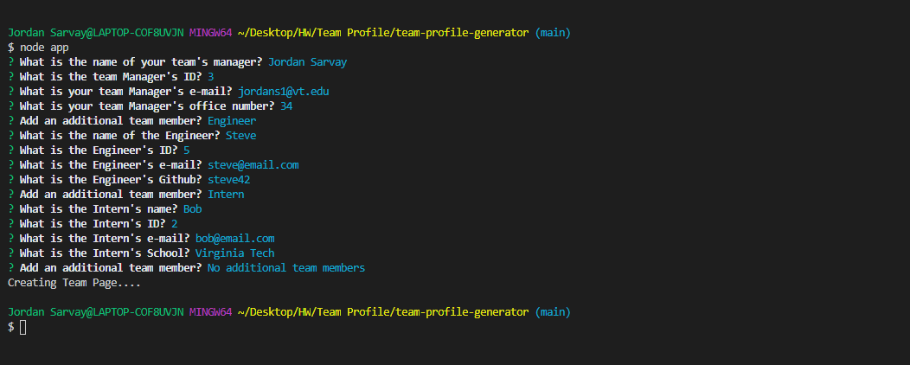
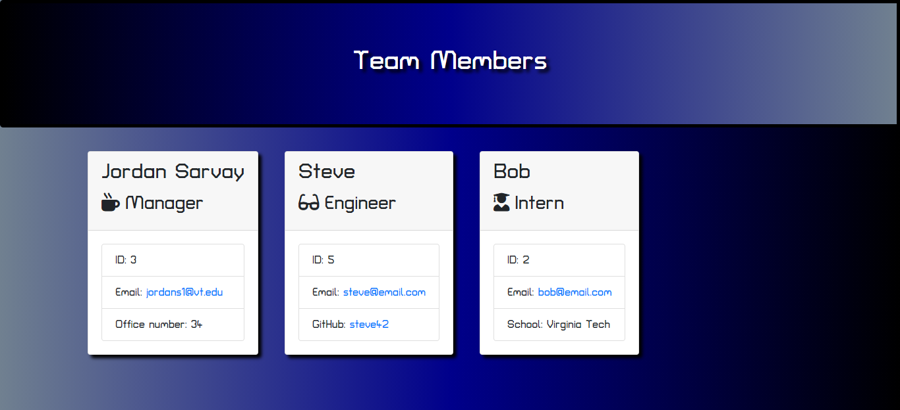

# Team Profile Generator
### Created by Jordan Sarvay

## Description
Run a command line prompt that allows the user to input information about their team and than generate a team profile page based on that command line input.

## Table of Contents
* [Installation](#installation)
* [Usage](#usage)
* [Contributing](#contributing)
* [Testing](#testing)
* [Questions](#questions)
    
## Installation

Copy the git link and perform a git clone to your local drive to create a local repository for you to work from. Run npm i to get the necessary dependencies for node.
    
## Usage

Simply run node app.js in the command line to begin the functions and answer the questions. Once you choose the option for having no additional team members, the HTML will be generated and published to the output folder in the repo.
    
## Contributing

If you are interested in contributing to this project, reach out to the creator to have a working branch established to upload to. All branches will be merged by the content creator to ensure a consistent app experience.

## Testing

There are four test files included in the test folder. These are run through the command 'npm run test'. All test utilize Jest.
    
## Questions

Please feel free to reach out to either of the following links with questions regarding the use of this application.

##### Github: [JSarvay](http://github.com/JSarvay/)
##### E-mail: jordans1@vt.edu

